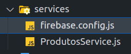
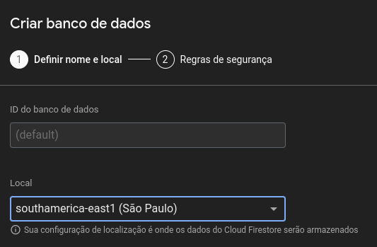

# Continuação:

## 1.  Adicionando firebase ao projeto

1. Abra o [console do firebase](https://console.firebase.google.com/?hl=pt-br) (clique).
2. Após acessar, clique em *criar um novo projeto*.


3. Defina o nome do projeto e **desative** o Google Analytics.
4. Após criar o projeto, clique para **adicionar um projeto a Web**. 


5. Defina um apelido ao app. Agora, será necessário instalar o firebase. Para isso, execute o comando: 
```js
npm install firebase
```
6. Após a conclusão da instalação, acesse a pasta *./services* em seu código e crie o arquivo **firebase.config.js**



7. Na raiz do seu projeto, crie o arquivo **.env**. Depois, adicione o **.env** em seu arquivo **.gitignore**.
8. No arquivo **.env**, adicione as seguintes linhas: No lugar de **xxxxx**, adicione os dados presentes no **SEU** firebase, **SEM AS ASPAS**.
```js 
REACT_APP_FIREBASE_API_KEY=xxxxx
REACT_APP_FIREBASE_AUTH_DOMAIN=xxxxx
REACT_APP_FIREBASE_PROJECT_ID=xxxxx
REACT_APP_FIREBASE_STORAGE_BUCKET=xxxxx
REACT_APP_FIREBASE_MESSAGING_SENDER_ID=xxxxx
REACT_APP_FIREBASE_APP_ID=xxxxx
``` 


## 2. Configurando banco de dados

1. Após a adição do firebase no projeto, é necessário criar um banco de dados no firebase. Para isso, abra o menu lateral ou acesse na tela inicial **Cloud Firestore** ou **Firestore Database**.


2. Ao acessar o Cloud Firestore, clique em **Criar banco de dados**. Selecione o servidor **São paulo**.



3. Clique em próximo(a). Na parte de Regras de segurança, selecione **Iniciar no modo de teste**.
